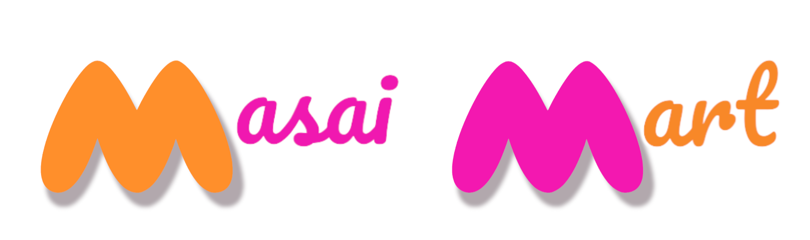

# Myntra Clone

## Renamed as :

# MASAI MART

## Website Logo :

# Myntra Clone
This is a clone of the Myntra website, created during the Construct Week at Masai.
## Technologies Used
- HTML
- CSS
- JavaScript
- NodeJs
- Express
- MongoDB
## Features
- Responsive design for desktop and mobile devices
- User authentication and registration
- Product details page with images, descriptions, and reviews
- Shopping cart and checkout system
- Order history and tracking

## Demo
You can see a live demo of this Myntra clone at [https://masai-mart-myntra.netlify.app/index.html].
## Installation
To install and run this project on your local machine, follow these steps:
1. Clone the repository using `git clone [REPO URL]`
2. Open the project directory in a code editor
3. Install dependencies using `npm install`
4. Start the development server using `npm start`
5. Open your web browser and go to `http://localhost:8080`

## Contributing
If you have any feedback or suggestions for how to improve this Myntra clone, feel free to create a pull request or open an issue.

